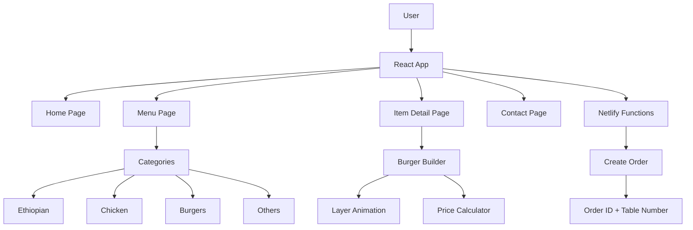

# 🍽️ Cinema Cafe Menu

**Developer**: [@black12-ag](https://github.com/black12-ag)  
**Live Site**: [https://restaurant-menu-3d-builder.netlify.app](https://restaurant-menu-3d-builder.netlify.app)

A modern, mobile-first digital restaurant menu designed for Cinema Cafe. Features a bilingual (English/Amharic) interface, QR code integration for contactless ordering, and an interactive menu browsing experience optimized for phone users.

---

## 📝 Project Description

Cinema Cafe Menu is a progressive web application built to modernize the dining experience. Customers can scan a QR code at their table to instantly access the full menu on their phones - no app download required. The menu includes 50+ items across 9 categories including Ethiopian specialties, burgers, pizza, pasta, salads, and desserts.

**Key Benefits:**

- 📱 **Contactless Ordering** - Scan QR code to view menu instantly
- 🌍 **Bilingual Support** - English and Amharic (አማርኛ) languages
- ⚡ **Fast Loading** - Optimized for mobile networks
- 🎨 **Beautiful Design** - Modern UI with smooth animations
- 📞 **One-Tap Calling** - Direct call button for orders

---

## 📱 Scan to View Menu

Scan this QR code with your phone to instantly view the menu:


**Or visit**: [https://restaurant-menu-3d-builder.netlify.app/menu](https://restaurant-menu-3d-builder.netlify.app/menu)

---

## 🎯 Features

- 🍔 **Interactive Burger Builder** - Build your burger with animated layers
- 🍲 **Ethiopian Dishes** - Sarma, Injera, Tibs, Kitfo, Shiro, Gomen
- 🍗 **Chicken Menu** - Grilled, Fried, Wings, Tikka
- 📱 **Mobile Friendly** - Works perfectly on phones
- 🌍 **Bilingual** - English and Amharic (አማርኛ)

---

## 🏗️ Architecture



---

## 🚀 Quick Start

```bash
# Clone
git clone https://github.com/black12-ag/menu.git
cd menu

# Install
npm install

# Run
npm run dev
```

---

## 🛠️ Tech Stack

| Tech          | Use        |
| ------------- | ---------- |
| React 18      | UI         |
| TypeScript    | Types      |
| Vite          | Build      |
| Tailwind CSS  | Styles     |
| Framer Motion | Animations |
| Netlify       | Hosting    |

---

## 📁 Project Structure

```
src/
├── components/
│   └── BurgerBuilder/     # Interactive burger builder
├── pages/
│   ├── HomePage/
│   ├── MenuPage/
│   ├── ItemDetailPage/    # Shows burger builder
│   └── ContactPage/
├── data/
│   ├── menuData.ts        # All menu items
│   └── categories.ts      # Categories
└── services/
    └── orderService.ts    # Order handling
```

---

## 🍔 Burger Builder

Add/remove ingredients:

- 🥬 Lettuce
- 🍅 Tomato
- 🧀 Cheese
- 🧅 Onion
- 🥒 Pickles

Toggle **Double Burger** for extra patty!

---

## 📝 Menu Categories

| Category  | Items                                               |
| --------- | --------------------------------------------------- |
| Ethiopian | Sarma, Doro Wat, Key Wat, Tibs, Kitfo, Shiro, Gomen |
| Chicken   | Grilled, Crispy, Wings, Tikka, Alfredo              |
| Burgers   | Classic, Cheese, Chicken, Bacon, Veggie             |
| Pizza     | Margherita, Pepperoni, Hawaiian, Meat Lovers        |
| + More    | Pasta, Salads, Sandwiches, Cakes, Drinks            |

---

## 🔄 Deployment

Auto-deploys to Netlify on every push to `main`.

---

Made with ❤️ by [Black12](https://github.com/black12-ag)
